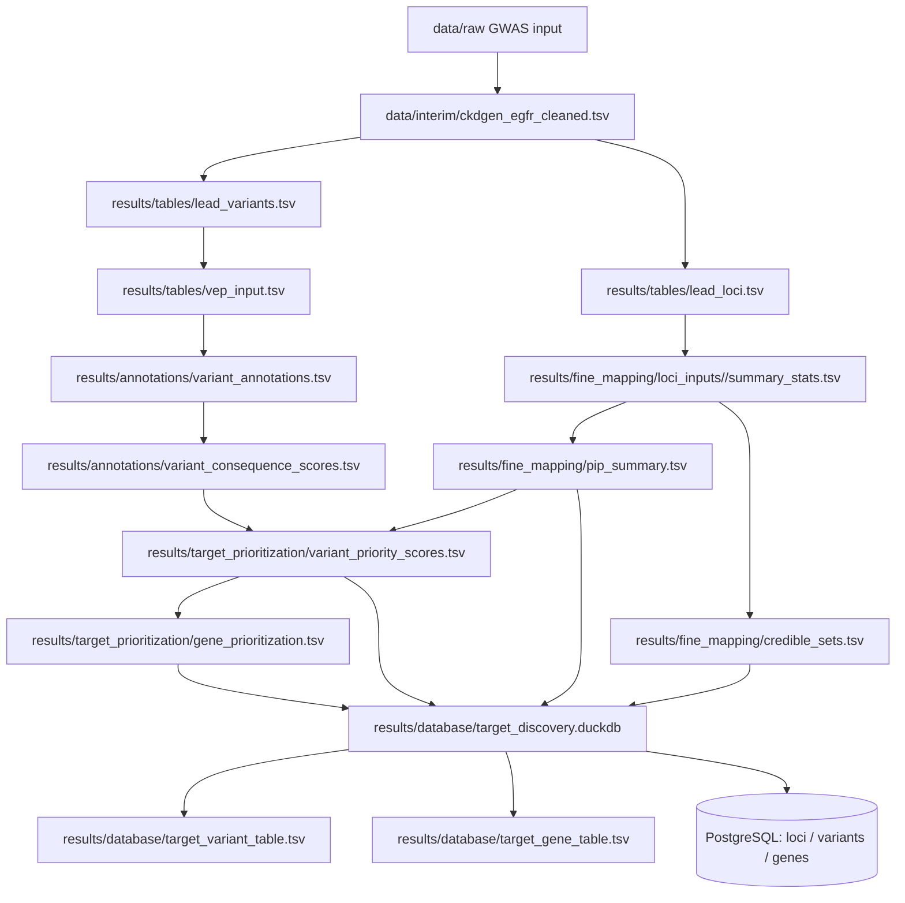

# Data Lineage

This document tracks how key project artifacts are created and connected.

## Key lineage checkpoints

- `lead_loci.tsv` defines locus windows.
- `pip_summary.tsv` and `credible_sets.tsv` are the primary fine-mapping outputs.
- `variant_priority_scores.tsv` and `gene_prioritization.tsv` integrate statistical + functional evidence.
- `target_discovery.duckdb` is the analytical source of truth for integrated querying.
