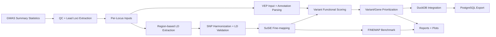

# Pipeline Architecture

This diagram summarizes the execution architecture from GWAS inputs to integrated outputs and benchmarking.

## Practical Notes

- Assembly handling is explicit as GRCh37 in the current project workflow.
- VEP is executed through Docker + offline cache mode.
- LD extraction is region-based from 1000 Genomes chromosome VCFs.
- Multi-locus runs use continue-on-error behavior so one failed locus does not stop the full batch.
