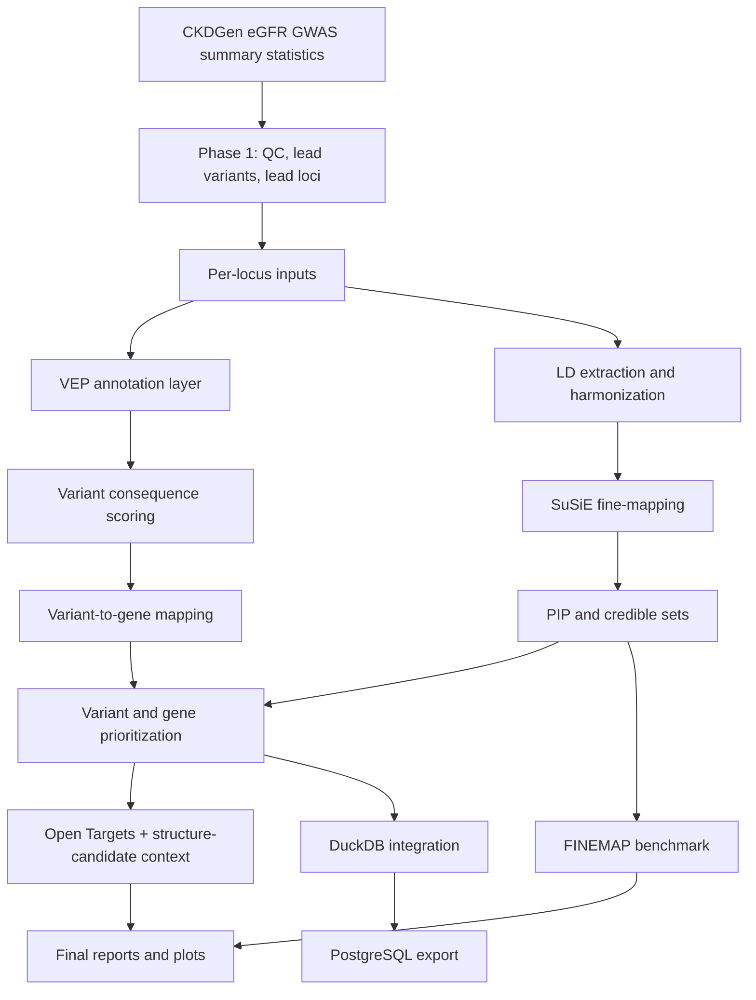

# Project Architecture

This document describes the current end-state architecture of the CKD target-discovery project.

## High-Level Workflow

## Text Workflow

1. **Phase 1 discovery**
   - Load, clean, and QC GWAS summary statistics.
   - Generate Manhattan/Q-Q plots.
   - Extract lead variants and lead loci.
2. **Per-locus preparation**
   - Build locus windows and harmonized summary statistics.
   - Validate LD contracts and ordering.
3. **Annotation + fine-mapping**
   - Annotate variants with VEP.
   - Run SuSiE and parse PIP/credible sets.
4. **Prioritization**
   - Compute transparent variant scores.
   - Aggregate to gene-level prioritization.
   - Integrate Open Targets and structure-candidate context.
5. **Benchmarking**
   - Run FINEMAP on successful-locus cohort.
   - Compare SuSiE vs FINEMAP outputs at variant/locus level.
6. **System integration**
   - Build analytical tables in DuckDB.
   - Export relational tables to PostgreSQL (`loci`, `variants`, `genes`).

## Core Data Boundaries

- `data/`: raw/reference inputs and external caches.
- `src/`: reusable code modules.
- `scripts/`: orchestration entry points.
- `results/loci/<locus_id>/`: per-locus outputs and diagnostics.
- `results/reports/`: manuscript-style summaries and interpretations.
- `results/database/`: integration-layer artifacts.

## Design Principles

- Keep scientific uncertainty explicit.
- Separate executed results vs scaffolded contracts.
- Preserve reproducibility through deterministic file paths.
- Prefer transparent scoring over black-box ranking.
